# NeoWallet ER Model v1

## Executive Summary

This document defines the complete Entity-Relationship (ER) model for NeoWallet MVP using Mermaid syntax. The model covers all 35 tables across 14 domains with their relationships, cardinality, primary keys, and foreign keys.

**Total Tables**: 35
**Total Relationships**: 40+
**Date**: August 18, 2026
**Status**: Ready for Product Owner Approval

---

## 1. Complete ER Model

```mermaid
erDiagram
    %% Identity Domain
    users ||--o{ user_credentials : "has"
    users ||--o{ user_sessions : "has"
    users ||--o{ user_devices : "has"
    users ||--o{ otp_challenges : "has"
    
    %% User Domain
    users ||--|| user_profiles : "has"
    users ||--|| user_preferences : "has"
    users ||--o{ user_addresses : "has"
    
    %% Family Domain
    users ||--o{ families : "owns"
    families ||--o{ family_members : "has"
    users ||--o{ family_members : "joins"
    families ||--o{ family_invitations : "sends"
    users ||--o{ family_invitations : "invites"
    
    %% User Profile to Family
    user_profiles }o--|| families : "belongs to"
    
    %% Financial Overview Domain
    users ||--o{ financial_overviews : "has"
    families ||--o{ financial_overviews : "has"
    financial_overviews ||--o{ financial_periods : "has"
    financial_overviews ||--o{ financial_allocations : "has"
    
    %% Transaction Domain
    users ||--o{ transactions : "has"
    families ||--o{ transactions : "belongs to"
    family_members ||--o{ transactions : "records"
    categories ||--o{ transactions : "categorizes"
    
    %% Category Domain
    categories ||--o{ categories : "parent of"
    
    %% Budget Domain
    users ||--o{ budgets : "has"
    families ||--o{ budgets : "has"
    budgets ||--o{ budget_categories : "has"
    categories ||--o{ budget_categories : "categorizes"
    budgets ||--o{ budget_periods : "has"
    budgets ||--o{ budget_recommendations : "has"
    users ||--o{ budget_recommendations : "receives"
    families ||--o{ budget_recommendations : "receives"
    
    %% Allocation Domain
    users ||--o{ allocation_recommendations : "receives"
    families ||--o{ allocation_recommendations : "receives"
    allocation_recommendations ||--o{ allocation_categories : "has"
    categories ||--o{ allocation_categories : "categorizes"
    allocation_recommendations ||--o{ allocation_versions : "has"
    allocation_recommendations ||--o{ allocation_approvals : "has"
    users ||--o{ allocation_approvals : "approves"
    
    %% Savings Domain
    users ||--o{ savings_goals : "has"
    families ||--o{ savings_goals : "has"
    savings_goals ||--o{ savings_contributions : "has"
    users ||--o{ savings_contributions : "contributes"
    savings_goals ||--o{ savings_progress : "has"
    
    %% Bill Domain
    users ||--o{ bills : "has"
    families ||--o{ bills : "belongs to"
    family_members ||--o{ bills : "assigned to"
    bills ||--o{ bill_status_history : "has"
    users ||--o{ bill_status_history : "changes"
    
    %% Notification Domain
    users ||--o{ notifications : "receives"
    notifications ||--o{ notification_deliveries : "delivered via"
    users ||--|| notification_preferences : "has"
    
    %% Financial Health Domain
    users ||--o{ financial_health_scores : "has"
    families ||--o{ financial_health_scores : "has"
    financial_health_scores ||--o{ financial_health_factors : "has"
    financial_health_scores ||--o{ financial_health_calculations : "has"
    
    %% AI Domain
    users ||--o{ ai_conversations : "has"
    families ||--o{ ai_conversations : "has"
    ai_conversations ||--o{ ai_messages : "contains"
    ai_conversations ||--o{ ai_tool_invocations : "invokes"
    ai_messages ||--o{ ai_tool_invocations : "triggers"
    ai_conversations ||--o{ ai_recommendations : "generates"
    ai_messages ||--o{ ai_recommendations : "contains"
    
    %% Audit Domain
    users ||--o{ audit_logs : "performs"
    
    %% Configuration Domain
    users ||--o{ user_configurations : "has"
```

---

## 2. Identity Domain ER Model

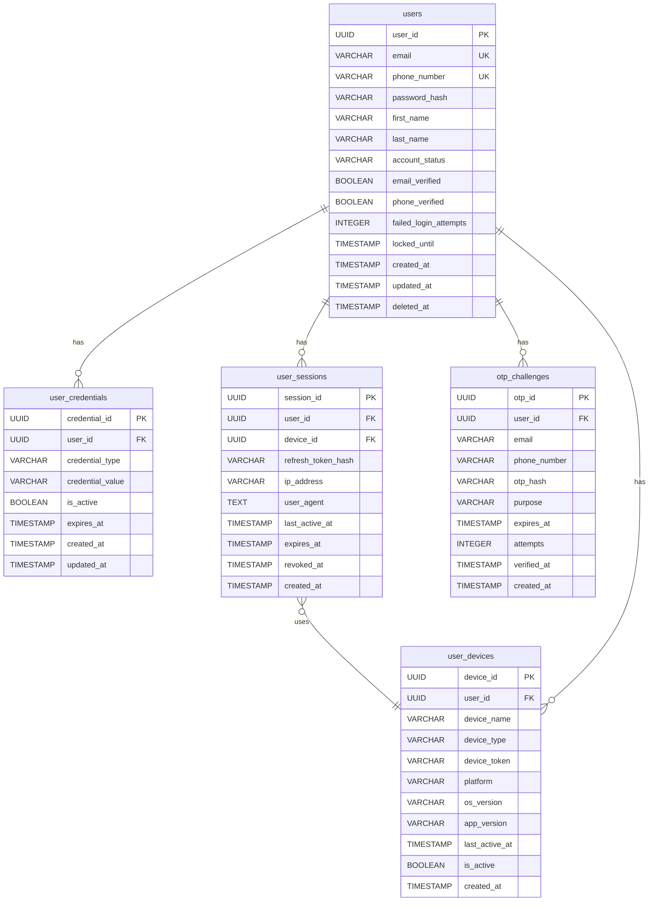

---

## 3. User Domain ER Model

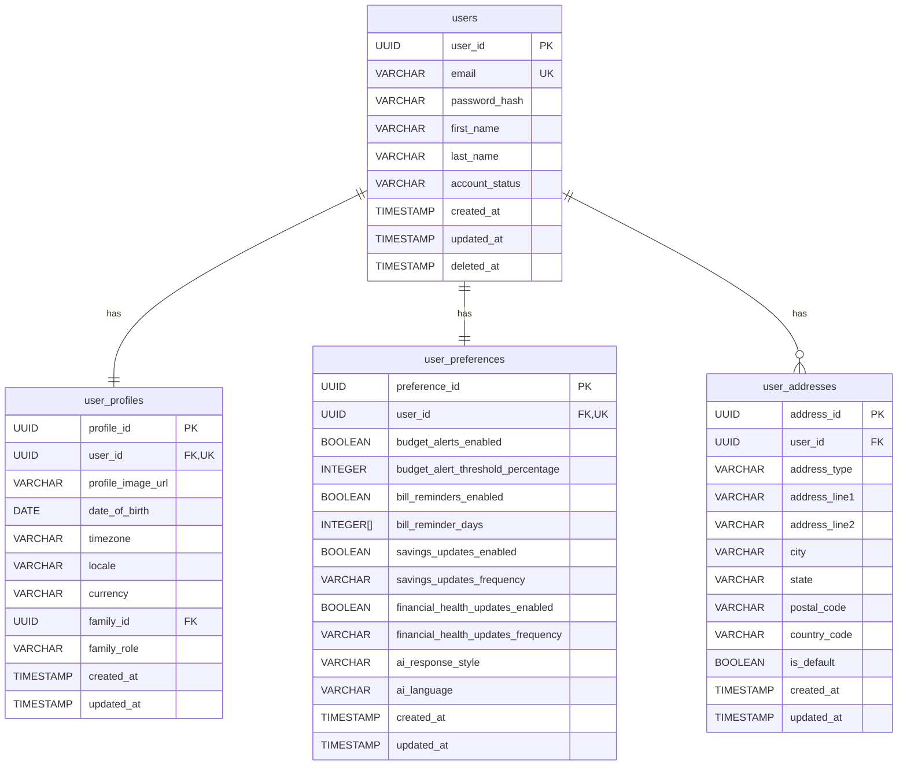

---

## 4. Family Domain ER Model

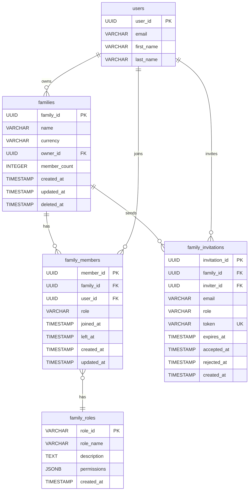

---

## 5. Financial Overview Domain ER Model

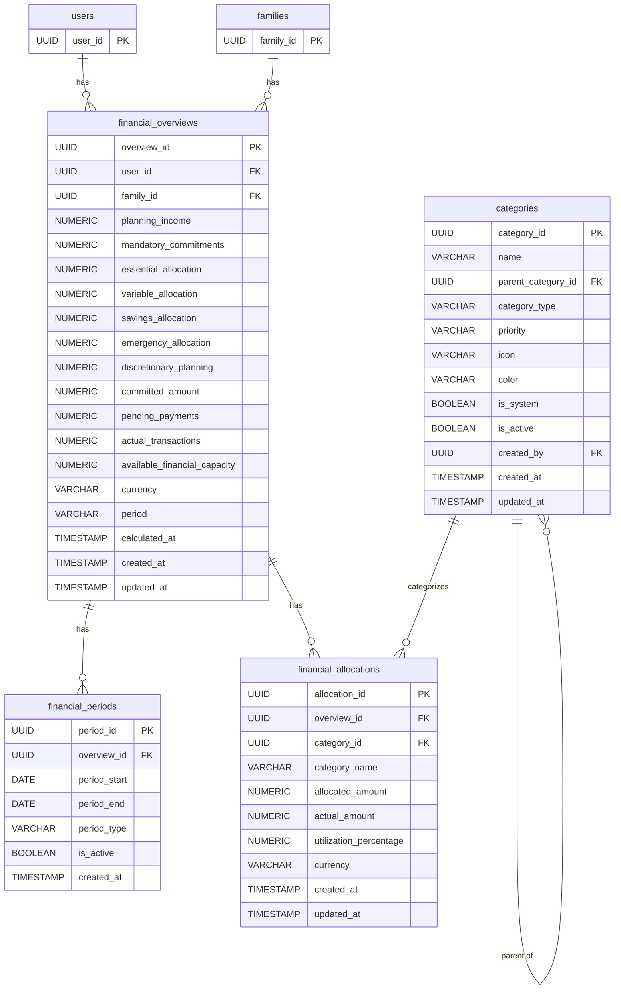

---

## 6. Transaction Domain ER Model

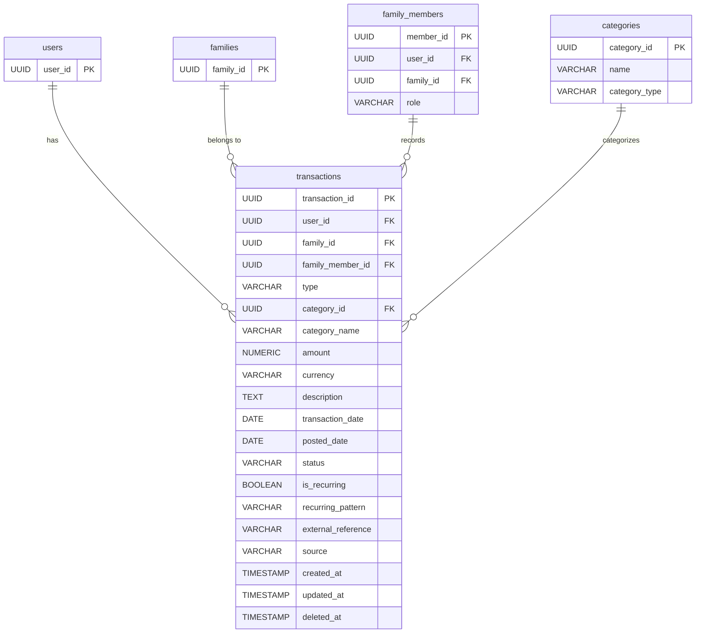

---

## 7. Budget Domain ER Model

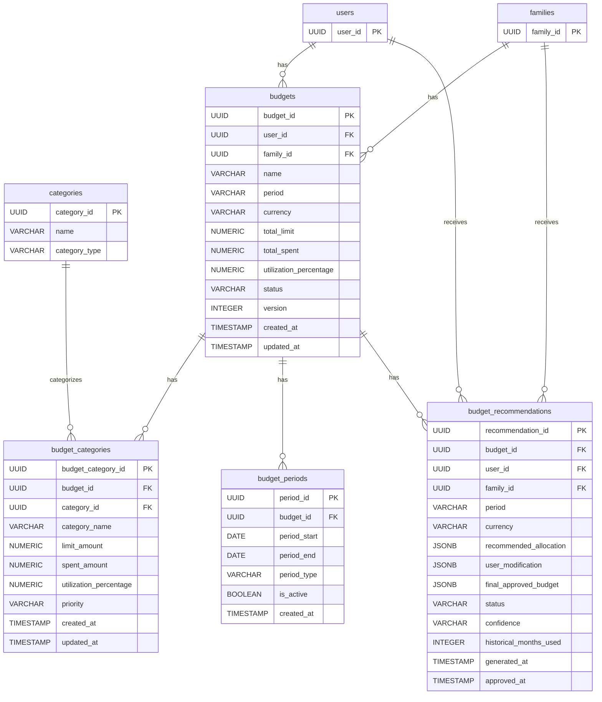

---

## 8. Allocation Domain ER Model

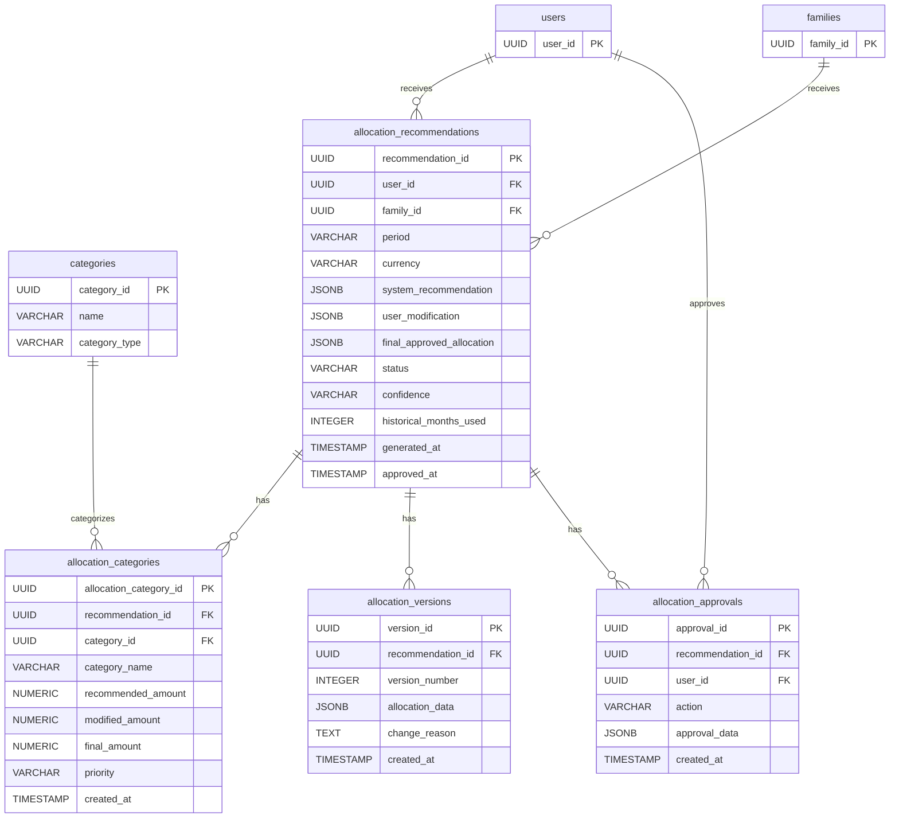

---

## 9. Savings Domain ER Model

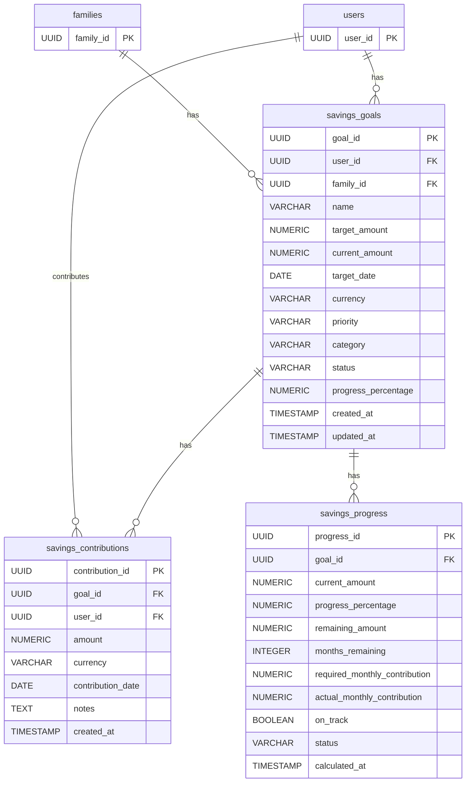

---

## 10. Bill Domain ER Model

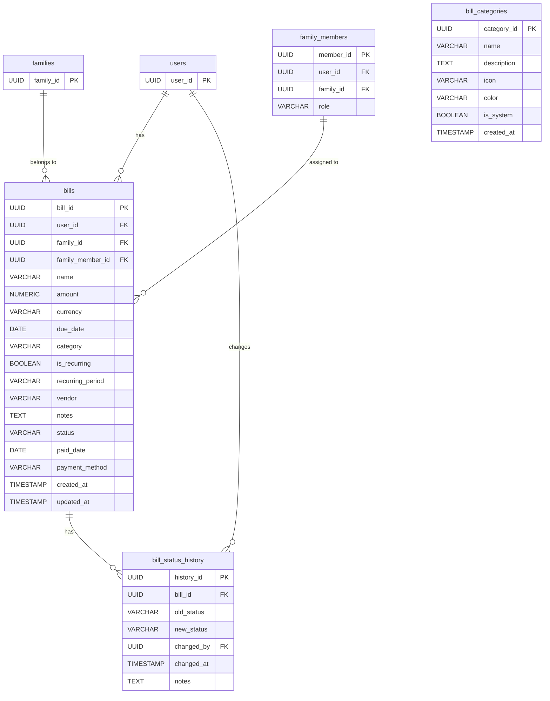

---

## 11. Notification Domain ER Model

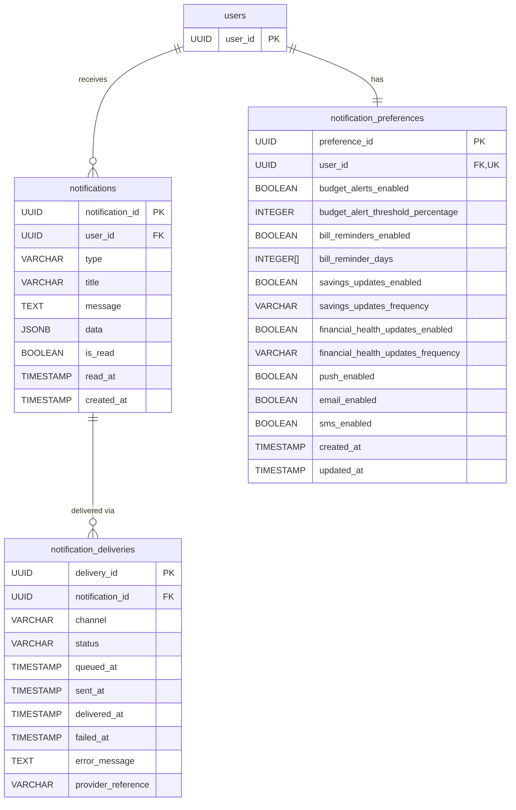

---

## 12. Financial Health Domain ER Model

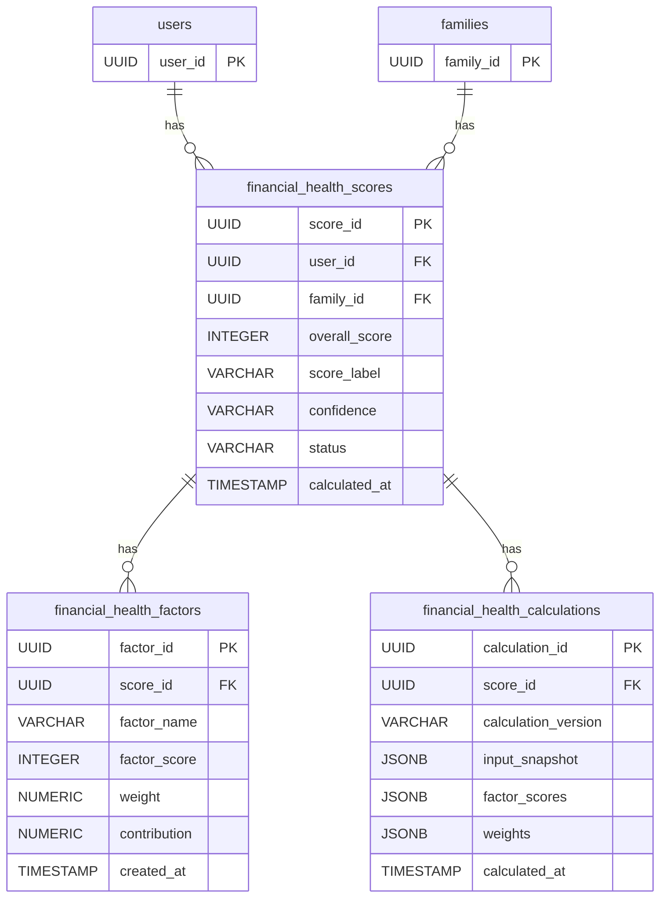

---

## 13. AI Domain ER Model

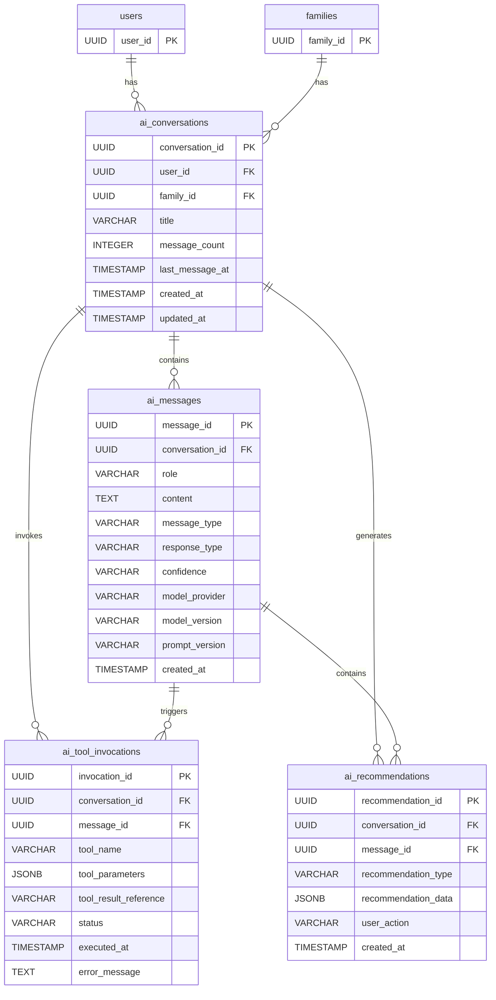

---

## 14. Audit Domain ER Model

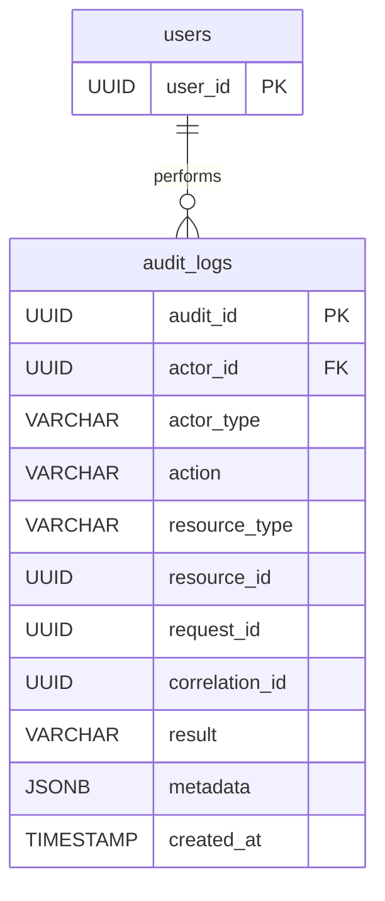

---

## 15. Configuration Domain ER Model

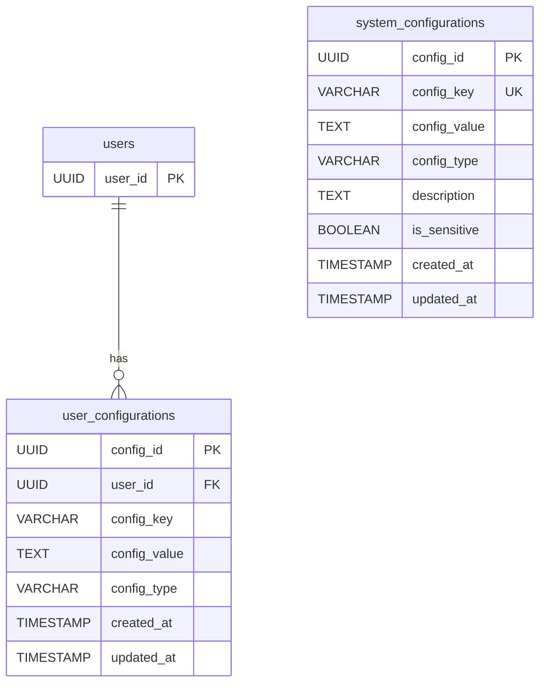

---

## 16. Relationship Summary

### 16.1 Cardinality Legend

- `||--||`: One-to-One (1:1)
- `||--o{`: One-to-Many (1:N)
- `}o--||`: Many-to-One (N:1)
- `}o--o{`: Many-to-Many (N:N)

### 16.2 Relationship Count by Domain

| Domain | Relationships |
|--------|---------------|
| Identity | 4 |
| User | 3 |
| Family | 5 |
| Financial Overview | 6 |
| Transaction | 4 |
| Budget | 7 |
| Allocation | 6 |
| Savings | 5 |
| Bill | 5 |
| Notification | 3 |
| Financial Health | 3 |
| AI | 6 |
| Audit | 1 |
| Configuration | 1 |
| **TOTAL** | **59** |

---

## 17. Key Relationships

### 17.1 User to Family

- `users` → `families` (1:N): User can own multiple families
- `users` → `family_members` (1:N): User can be member of multiple families
- `families` → `family_members` (1:N): Family has multiple members
- `user_profiles.family_id` → `families` (N:1): User profile belongs to one family

### 17.2 Financial Data Ownership

- All financial tables have `user_id` or `family_id`
- Server-side authorization required for cross-family access
- Family membership checked before data access

### 17.3 AI Security

- `ai_conversations` → `ai_messages` (1:N): Conversation has messages
- `ai_messages` → `ai_tool_invocations` (1:N): Messages trigger tool invocations
- AI has NO direct database access
- AI accesses data only through authorized application tools/APIs

### 17.4 Audit Trail

- `audit_logs` → `users` (N:1): Audit logs track user actions
- Audit logs are immutable (no UPDATE, no DELETE)
- ON DELETE RESTRICT prevents deletion of users with audit logs

---

## 18. Conclusion

The NeoWallet ER model defines 35 tables across 14 domains with 59 relationships. The model emphasizes:

- **Financial Safety**: No custodial wallet balance tables
- **Planning vs Actual**: Clear separation of planning data and actual transactions
- **Family Isolation**: Server-side authorization with family membership
- **Audit Trail**: Immutable audit logs for sensitive operations
- **AI Security**: AI has no direct database access

**Next Steps**:
1. Create Data Dictionary
2. Create Traceability Matrix
3. Create Validation Report
